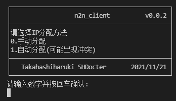
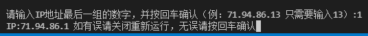
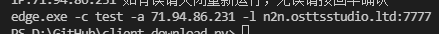
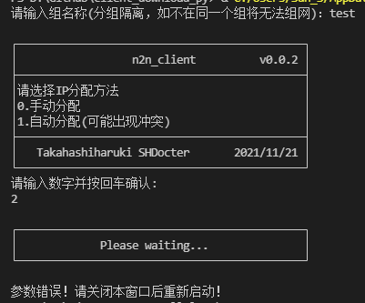

# 如何使用

### 1、安装TAP虚拟网卡（默认设置）
  

### 2、运行n2n_client.exe

### 3、输入组名称
  
  

### 4、选择IP分配方式
  

* 手动分配：手动自定义IP（暂时不支持自定义IP段，所以每个分组理论上限255名用户），例：IP为192.168.100.13，只需要输入最后一段的13，前面三段目前版本无法自定义。

* 自动分配：程序自动分配IP，因为算法只是简单的随机数，并且没有联网验证，可能会出现重复IP，概率大概是1/255，如果碰到了，建议原地结婚（bushi）。

### 5、确认信息

### 6、二次确认

请确认组名和IP，如果不在同一个组将无法联机

参数解释：-c 组名 -a 分配给你的内网IP -l 服务器IP

（因为return比较麻烦，最近几个版本没有写return的打算，如果输入错误只能关闭程序重新启动，未来版本可能会写，整个维护组都是老懒狗ww）

# 目前已知公开情报

* 本项目为公益项目，因为服务器和带宽成本的原因，仅限字幕组使用，请勿外传，并且将根据从发布开始一个月内的带宽使用量来决定是否继续维护下去
* 本项目目前处于测试阶段，服务器配置极差，我们目前并不清楚转发数据包需要占用多少资源，所以如果有大量用户同时使用的情况下，延迟可能会飙升
* v0.0.1是周末值班摸鱼和高师傅一起不到俩小时写出来的（90%的代码都是高师傅的手笔）
* v0.0.2是写这篇教程的时候现改的
* 本项目的灵感来源于EasyN2N，EasyN2N其实挺方便的，也很成熟，但唯一可惜的一点是用易语言写的，屏蔽杀软比较麻烦
* 这个味儿巨浓的UI是高师傅的恶趣味，其实早期版本是用的*号（好像味儿也挺浓的）

* 目前版本没有自动更新，未来一定会写，除非不更新了，在这之前的更新将会通过bot发送新版本链接或者见[这里](http://n2n.osttsstudio.ltd/download.html)
* 本项目目前只是早期版本，会在未来逐渐完善，也欢迎有大佬加入本项目一起敲代码
* 项目基于[n2n](https://github.com/ntop/n2n)以及python3.9.5和TAP虚拟网卡，所调用的库均为内置库
* 因为是公益项目，这种项目应该也不会有人愿意接手，所以在可以预见的未来，本项目必定会停止维护，但我们不接受任何资金方面的帮助，倒是欢迎有人一起来维护本项目（[GitHub](https://github.com/osttsStudio/N2N-Client-py)）
* 在自动更新完善之前不推荐在有bot外的字幕组推广本项目，且目前未打算制作日语版（我寻思日v貌似也用不到这玩意儿），未来可能会和星间bot联动，如果有那个时候，应该会发布日语版
* 因为是早期版本，所以目前只有腾讯云上海节点，实测新加坡延迟和大陆差不多（测试环境：Tabletop Simulator）未来会考虑增加香港、海外和更多的大陆节点（虽然因为成本的原因，海外和更多的大陆节点大概会在很远的未来）
* N2N原理：在NAT环境较好的情况下点对点打洞，也就是所谓的p2p，在NAT环境较复杂或者根本无法打洞的情况下通过服务器中转数据包，如有需求，未来版本也可以设置强制服务器中转，因为并不推荐该方法，所以没有硬性需求将不会有这方面的更新，但可以运行edge.exe自行跟参
### 基于上方的原理，客户端之间的延迟算法为：
* p2p：host1到host2的延迟
* 中转：host1到服务器的延迟 + host2到服务器的延迟
# 写在最后的废话

我们并不知道这个项目会不会像以前的许多项目一样因为各种各样的原因半路夭折，比如来自现实和工作的压力，比如自身能力的不足，但至少在现在的时间点，我们还保持着热血，还能趁着年少，去做自己喜爱的事情。

狐日泽&高橋はるき

SHDocter&TakahashiHaruki

